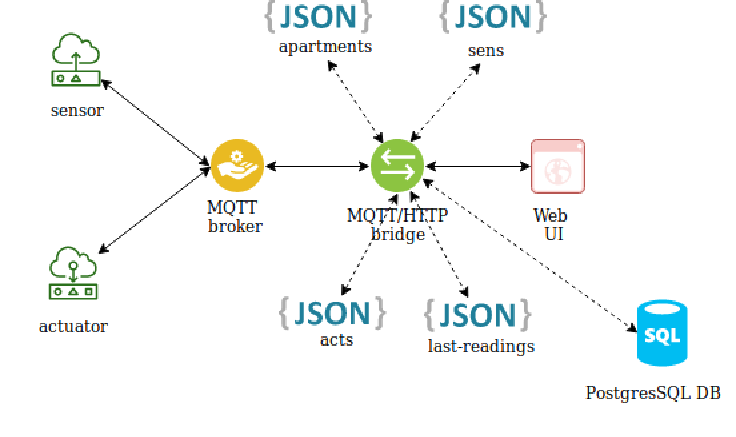
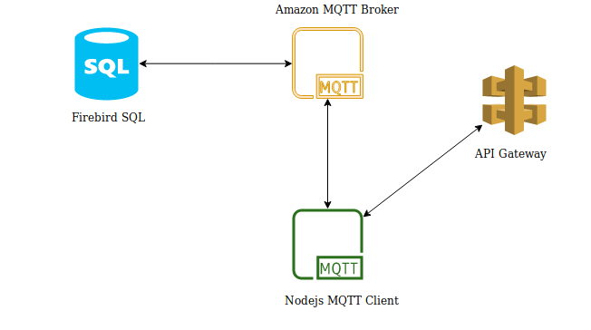

# CHRONOTHERMOSTAT

**CHRONOTHERMOSTAT** è un'applicativo basato su IoT che permette di regolare comodamente la temperatura di un appartamento.

## Architettura Software

Di seguito è possibile trovare l'architettura software utilizzata. Questa sezione è divisa in due, la prima rigurda l'architettura locale che fa riferimento agli applicativi direttamente installati sul Raspberry, la seconda mostra invece come l'applicativo interagisce con l'API e l'MQTT broker forniti.

### Architettura locale

Procedendo da sinistra troviamo sensori ed attuatori. Lo schema in questo caso risulta semplificato in quanto ogni stanza prevede un sensore e due attuatori, il primo collegato ad un ESP8266 NodeMCU gli altri ad un ESP8266. Tutti e tre i dispositivi comunicano con il raspberry tramite MQTT, di seguito uno schema dei messaggi inviati/ricevuti dai dispositivi:

| device | sub topic | pub topic |
| :----: | :-------: | :-------: |
| sensor |   NONE    |  presence, readings |
| heat actuator | command-ha:MAC_ADDRESS | presence |
| cool actuator | command-ha:MAC_ADDRESS | presence |

- **presence**: permette di comunicare la presenza del dispositivo, questo serve in fase di settings
- **command-ha/ca:MAC_ADDRESS**: questo topic è univoco per ogni attuatore, questo gli permette di ricevere i messaggi di on/off

I messaggi MQTT sul raspberry vengono gestiti da un apposito broker: [Eclipse Mosquitto](https://mosquitto.org/), questo ci permette di smistare i messaggi verso gli applicativi che ne richiedono notifica. Andando avanti troviamo il cuore dell'applicazione, esso è costituito da un applicativo che fa da server, scritto con [Node express](https://expressjs.com/it/). Nello schema architetturale viene descritto come bridge HTML/MQTT in quanto esso si prende carico di trasformare richieste http in messaggi mqtt, questo perché l'interfaccia fornita all'utente è un'interfaccia web ed il protocollo http risultava più adatto per l'interazione tra le due parti. La suddivisione delle sotto parti riguardanti il codice sono organizzate seguendo un noto modello architetturale che riguarda applicativi web lato server. Il punto di lancio è offerto dal file `app.js`, il resto dell'applicazione è diviso come segue: 

- **routes:** i file in questa directory servono da routes applicative, in questo modo si favorisce la distribuzione del carico e la modularità
- **db:** in questa cartella si trovano i file json che servono a memorizzare alcune informazioni importanti per l'applicazione:
	- **sens:** memorizza i sensori che hanno comunicato la loro presenza dopo essersi accesi
	- **acts:** stessa cosa, ma per gli attuatori
	- **apartment:** memorizza la conformazione dell'appartamento (stanze e relativi dispositivi)
	- **last-readings:** memorizza le ultime letture effettuate dai sensori
	- **mysqlClient.js** client mysql, serve a persistere le letture su un db remoto
- **mqtt:** cartella contenenti due file, `mqtt_client.js` e `aws_mqtt_client.js`, rispettivamente utilizzati per gestire la comunicazione tramite MQTT in locale e da/verso il server Amazon. Infine troviamo la web interface descritta da un'applicazione [Angular](https://angular.io/). La scelta di questo framework è dovuta ai diversi benefici che esso porta, riduce il tempo di stesura dell'applicazione, ha una forte comunità di sviluppo, supporta la modularità dato un paradigma di progettazione orientato ai componenti ed inoltre permette comodamente di servire diversi dispositivi senza dover cambiare il codice.
  

### Architettura Rasp + API + MQTT

Il bridge HTTP/MQTT ha anche, come detto in precedenza, il ruolo di interfacciarsi con due componenti remote fornite da specifica:

- una REST API risiedente su Amazon e2c
- un MQTT broker anch'esso relativo ad Amazon

le specifiche relative a queste due componenti si possono trovare su: [github repository](https://github.com/german-sv/comsys19) 
